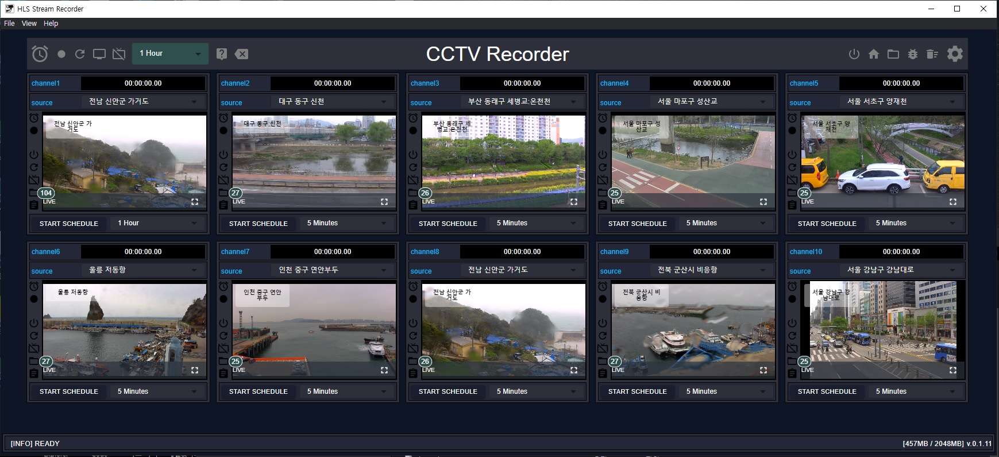
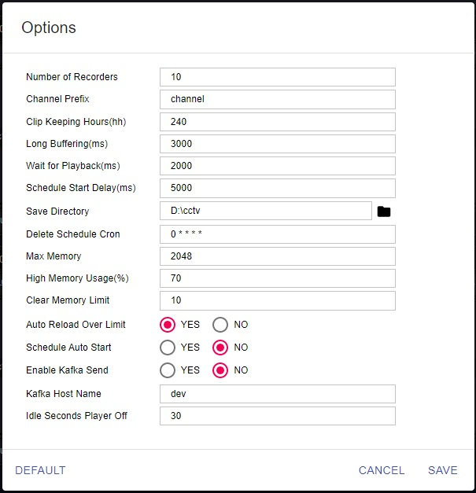

## 개발환경 

git clone 
```
git clone https://gitlabsvr.sbs.co.kr/S9A4268/hls-stream-recorder.git
```
의존모듈 설치
```
cd hls-stream-recorder
yarn
```

ffmpeg binary copy 

```bash
cp ffmpeg.exe hls-stream-recorder/src/bin
```

## 개발모드
```
cd hls-stream-recorder
yarn run start
```

## 패키징

windows용 파일 build

```bash
yarn run package
```

## 참고사항
기술 스택

> 템플리트 : [Electron-React-BoilerPlate](https://github.com/electron-react-boilerplate/electron-react-boilerplate)

> LocalDB : [electron-store](https://github.com/sindresorhus/electron-store)

> 인코딩 : [ffmpeg](https://www.ffmpeg.org/)

> 스케쥴 : [node-cron](https://www.npmjs.com/package/node-cron)

> 플레이어 : [videojs](https://videojs.com/)

> UI템플리트 : [material-ui](https://material-ui.com/)


## 문서
화면구성



옵션설명



> Number of Recorders : 레코더 숫자

> Channel Prefix : 채널 명

> Clip Keeping Hours : 클립 저장기간(시간)

> Long Buffering : Long buffering 판정시간(이 시간동안 버퍼링 지속되면 플레이어 리로드)

> Wait for Playback: 녹화 시작 후 playback 표시하기까지 대기시간

> Schedule Start Delay : 전체 녹화시작버튼(좌상단) 클릭 시 채널별 시작시간 Delay

> Save Directory : 저장 디렉토리

> Delete Schedule Cron : Crontab 형식의 삭제 스케쥴 (0 * * * * * == 매 00분 마다 삭제)

> Max Memory : 최대 사용메모리

> High Memory Usage : 메모리 사용량이 높다고 판정되는 사용율. 이 사용율이 되면 electron clear cache 수행

> Clear Memory Limit : 위 clear cache 명령 수행 최대값. 이 값을 넘으면 Application 전체 Reload됨

> Auto Reload Over Limit : 위 전체 Reload enable/disable

> Schedule Auto Start : 프로그램 시작 시 자동 스케쥴 시작 여부

> Enable Kafka Send : Kafak로 클립인코딩 로그 발송할 것인지 여부

> Kafak Host name : 로그 분석 시 사용할 클라이언트 식별자

> Idle Seconds Player off : 자동으로 player preview off할 idle time (seconds) - 적은 메모리 사용

## 라이센스

MIT © [Electron React Boilerplate](https://github.com/electron-react-boilerplate)
